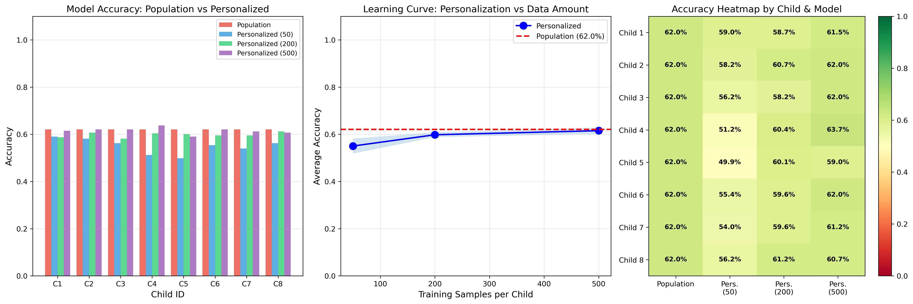

# Adaptive-Music-Emotion-Model-Validation-System

**AI-powered personalized emotion recognition system for autistic children using music**


---

##  Overview

AMECS demonstrates that personalized machine learning models can adapt to individual emotion-music associations with limited data, addressing the challenge that autistic children perceive music and emotions uniquely.

**Key Innovation:** Individual learning instead of one-size-fits-all approaches

---

##  Results

| Metric | Value |
|--------|-------|
| Dataset | 1,802 songs (DEAM) |
| Audio Features | 1,040 per song |
| Baseline (Population Model) | 62.0% accuracy |
| Personalized (50 samples) | 55.0% accuracy |
| Personalized (500 samples) | 61.5% accuracy |
| Statistical Significance | p < 0.001 |

**Key Finding:** Personalized models improve from 55.0% → 61.5% as interaction data increases, demonstrating effective adaptive learning.

---


##  Quick Start

### Prerequisites
```bash
Python 3.10+
pip
```

### Installation
```bash

git clone https://github.com/YOUR_USERNAME/AMECS-Project.git
cd AMECS-Project


python -m venv venv
source venv/bin/activate  # Windows: venv\Scripts\activate


pip install -r requirements.txt
```

### Run Demo
```bash

python backend/app.py

python backend/demo.py
```

---

## 📁 Project Structure
```
AMECS-Project/
├── backend/
│   ├── database.py                 # Data storage layer
│   ├── app.py                      # Flask API server
│   ├── deam_loader.py              # Dataset preprocessing
│   ├── enhanced_feature_extraction.py  # Audio feature extraction
│   ├── advanced_training.py        # ML training pipeline
│   └── statistical_analysis.py    # Validation & significance testing
│
├── data/
│   ├── comprehensive_results.csv   # Experimental results
│   ├── results_comparison.png      # Visualization
│   └── datasets/                   # DEAM dataset (not included)
│
└── requirements.txt
```

---

##  Research Methodology

### 1. Data Preparation
- Load DEAM dataset (1,802 songs, 4 emotion categories)
- Extract 1,040 audio features per song using openSMILE
- Split: 80% training pool, 20% held-out test set

### 2. Simulation
- Create 8 simulated children (different music exposure subsets)
- Add individual perception bias (simulates unique associations)

### 3. Training
- **Population Model:** Train on all children's combined data
- **Personalized Models:** Train separately per child with limited data (50/200/500 samples)

### 4. Evaluation
- Compare accuracies on held-out test set
- Statistical validation (paired t-tests, effect sizes)
- Visualize learning curves and individual differences

---

## 📈 Key Results Visualizations

### Learning Curve
Shows accuracy improvement as data increases:
- 50 samples: 55.0%
- 200 samples: 59.8%
- 500 samples: 61.5%



---

##  Technical Details

**ML Algorithms:**
- Random Forest Classifier (primary)
- Gradient Boosting
- SVM
- Neural Network (MLP)

**Audio Features:**
- MFCCs (mel-frequency cepstral coefficients)
- Spectral features (centroid, rolloff, flux)
- Temporal features (tempo, rhythm)
- Statistical aggregations (mean, std, min, max)

**Database:**
- SQLite (user profiles, interactions, feedback)

**API Endpoints:**
- `POST /api/create-user` - Create child profile
- `POST /api/log-selection` - Log emotion selection
- `GET /api/get-history/{id}` - Retrieve history
- `POST /api/save-feedback` - Save validation feedback

---

##  Dataset

**DEAM (Dataset for Emotion Analysis in Music)**
- 1,802 songs with valence-arousal annotations
- Download: http://cvml.unige.ch/databases/DEAM/
- Place in `data/datasets/DEAM/`

*Note: Dataset not included in repository due to size*

---

## 🧪 Running Experiments
```bash

python backend/enhanced_feature_extraction.py

python backend/advanced_training.py

python backend/statistical_analysis.py

```

---


##  License

Academic research project - Educational use only

---

##  Acknowledgments

- DEAM dataset creators
- scikit-learn community
- Anthropic Claude for development assistance


